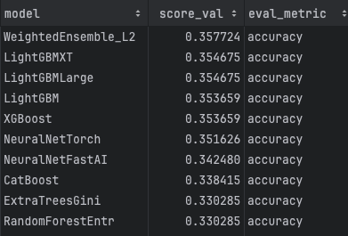
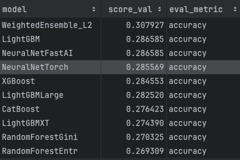

Version 1:  
just using data of periods of 4 seconds voltage values 160Hz  
data shape: n * 640(160 Hz * 4 s )  
n: smaples number  
[DataSetOriAutogluon.ipynb](Experiments%2FDataSetOriAutogluon.ipynb)  

Version 2:(Same method of old data supply)  
using autogluon to run with parameters which extracted to represent mean value of BrainWave during period  
data shape: n * 9 (**Brainwave parameters** without Meditation and Attention)  
[DataSetBrainwaveExtractAutogluon.ipynb](Experiments%2FDataSetBrainwaveExtractAutogluon.ipynb)  

Version 3:  
Frequency Image to train ResNet18 or EfficientNetB0(B1) model(CV method)
Data Prepare:  

Version 4:  
Melspectrogram Image to train ResNet18 or EfficientNetB0(B1) model(CV method)  
Data Prepare:  
- db value do the normalize process ref:  
Q1: [Question&Analysis.md](Question&Analysis.md)

| n_fft |    hop_length    | win_length | ResNet18 | EfficientNetB0 | EfficientNetB1 |
|:-----:|:----------------:|:----------:|:--------:|:--------------:|:--------------:|
| 1024  | len(signal)//256 |    128     |    -     |       -        |      0.34      |
|  512  |       10ms       |    128     |    -     |       -        |      0.29      |
|  512  |       10ms       |    128     |    -     |       -        |      0.29      |
Something not change:  
dpi : 300
Resize : 224, 224

Version 5:  
TimeFrequency Spectrogram - xtick(time) ytick(Frequency) color(Magnitude)  
Example Figure:  

Source Code:  
[FrequencyImage.py](DataSetConvertImage%2FSignal2Image%2FFrequencyImage.py)
